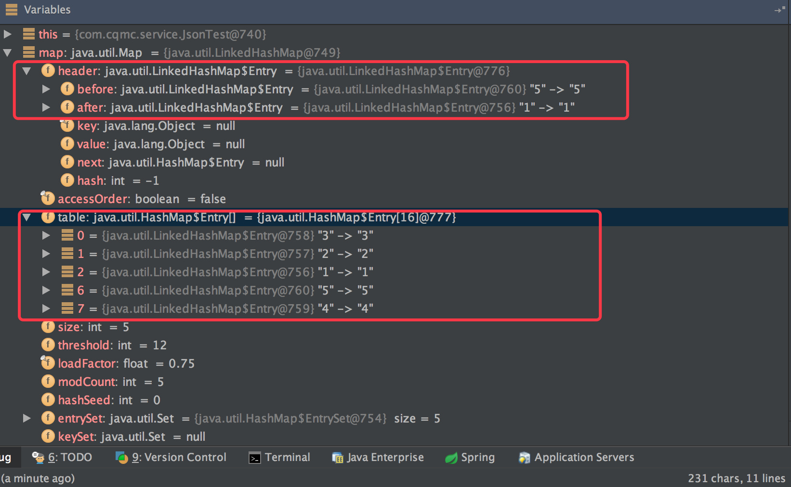
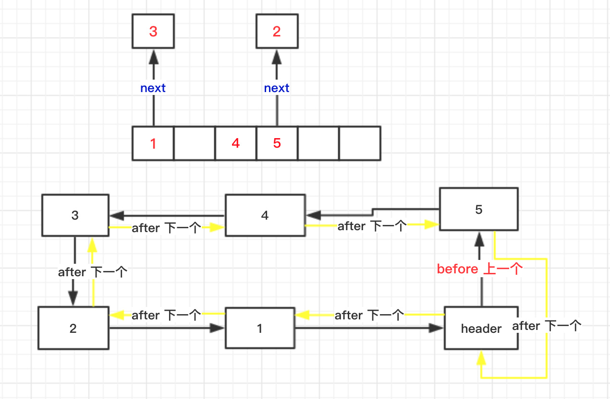

# LinkedHashMap源码分析

众所周知 [HashMap](https://github.com/crossoverJie/Java-Interview/blob/master/MD/HashMap.md) 是一个无序的 `Map`，因为每次根据 `key` 的 `hashcode` 映射到 `Entry` 数组上，所以遍历出来的顺序并不是写入的顺序。

因此 JDK 推出一个基于 `HashMap` 但具有顺序的 `LinkedHashMap` 来解决有排序需求的场景。

它的底层是继承于 `HashMap` 实现的，由一个双向链表所构成。

`LinkedHashMap` 的排序方式有两种：

- 根据写入顺序排序。
- 根据访问顺序排序。

其中根据访问顺序排序时，每次 `get` 都会将访问的值移动到链表末尾，这样重复操作就能的到一个按照访问顺序排序的链表。

## 数据结构

```
@Test
public void test(){
	Map<String, Integer> map = new LinkedHashMap<String, Integer>();
	map.put("1",1) ;
	map.put("2",2) ;
	map.put("3",3) ;
	map.put("4",4) ;
	map.put("5",5) ;
	System.out.println(map.toString());

}
```

调试可以看到 `map` 的组成：



打开源码可以看到：

```
/**
 * The head of the doubly linked list.
 */
private transient Entry<K,V> header;

/**
 * The iteration ordering method for this linked hash map: <tt>true</tt>
 * for access-order, <tt>false</tt> for insertion-order.
 *
 * @serial
 */
private final boolean accessOrder;

private static class Entry<K,V> extends HashMap.Entry<K,V> {
    // These fields comprise the doubly linked list used for iteration.
    Entry<K,V> before, after;

    Entry(int hash, K key, V value, HashMap.Entry<K,V> next) {
        super(hash, key, value, next);
    }
}
```

其中 `Entry` 继承于 `HashMap` 的 `Entry`，并新增了上下节点的指针，也就形成了双向链表。

还有一个 `header` 的成员变量，是这个双向链表的头结点。

上边的 demo 总结成一张图如下：



第一个类似于 `HashMap` 的结构，利用 `Entry` 中的 `next` 指针进行关联。

下边则是 `LinkedHashMap` 如何达到有序的关键。

就是利用了头节点和其余的各个节点之间通过 `Entry` 中的 `after` 和 `before` 指针进行关联。

其中还有一个 `accessOrder` 成员变量，默认是 `false`，默认按照插入顺序排序，为 `true` 时按照访问顺序排序，也可以调用:

```
public LinkedHashMap(int initialCapacity,
                     float loadFactor,
                     boolean accessOrder) {
    super(initialCapacity, loadFactor);
    this.accessOrder = accessOrder;
}
```

这个构造方法可以显示的传入 `accessOrder`。

## 构造方法

`LinkedHashMap` 的构造方法:

```
public LinkedHashMap() {
    super();
    accessOrder = false;
}
```

其实就是调用的 `HashMap` 的构造方法:

`HashMap` 实现：

```
public HashMap(int initialCapacity, float loadFactor) {
    if (initialCapacity < 0)
        throw new IllegalArgumentException("Illegal initial capacity: " +
                                           initialCapacity);
    if (initialCapacity > MAXIMUM_CAPACITY)
        initialCapacity = MAXIMUM_CAPACITY;
    if (loadFactor <= 0 || Float.isNaN(loadFactor))
        throw new IllegalArgumentException("Illegal load factor: " +
                                           loadFactor);

    this.loadFactor = loadFactor;
    threshold = initialCapacity;
    //HashMap 只是定义了改方法，具体实现交给了 LinkedHashMap
    init();
}
```

可以看到里面有一个空的 `init()`，具体是由 `LinkedHashMap` 来实现的：

```
@Override
void init() {
    header = new Entry<>(-1, null, null, null);
    header.before = header.after = header;
}
```

其实也就是对 `header` 进行了初始化。

## put 方法

看 `LinkedHashMap` 的 `put()` 方法之前先看看 `HashMap` 的 `put` 方法：

```
public V put(K key, V value) {
    if (table == EMPTY_TABLE) {
        inflateTable(threshold);
    }
    if (key == null)
        return putForNullKey(value);
    int hash = hash(key);
    int i = indexFor(hash, table.length);
    for (Entry<K,V> e = table[i]; e != null; e = e.next) {
        Object k;
        if (e.hash == hash && ((k = e.key) == key || key.equals(k))) {
            V oldValue = e.value;
            e.value = value;
            //空实现，交给 LinkedHashMap 自己实现
            e.recordAccess(this);
            return oldValue;
        }
    }

    modCount++;
    // LinkedHashMap 对其重写
    addEntry(hash, key, value, i);
    return null;
}

// LinkedHashMap 对其重写
void addEntry(int hash, K key, V value, int bucketIndex) {
    if ((size >= threshold) && (null != table[bucketIndex])) {
        resize(2 * table.length);
        hash = (null != key) ? hash(key) : 0;
        bucketIndex = indexFor(hash, table.length);
    }

    createEntry(hash, key, value, bucketIndex);
}

// LinkedHashMap 对其重写
void createEntry(int hash, K key, V value, int bucketIndex) {
    Entry<K,V> e = table[bucketIndex];
    table[bucketIndex] = new Entry<>(hash, key, value, e);
    size++;
}
```

主体的实现都是借助于 `HashMap` 来完成的，只是对其中的 `recordAccess(), addEntry(), createEntry()` 进行了重写。

`LinkedHashMap` 的实现：

```
    //就是判断是否是根据访问顺序排序，如果是则需要将当前这个 Entry 移动到链表的末尾
    void recordAccess(HashMap<K,V> m) {
        LinkedHashMap<K,V> lm = (LinkedHashMap<K,V>)m;
        if (lm.accessOrder) {
            lm.modCount++;
            remove();
            addBefore(lm.header);
        }
    }
    
    
//调用了 HashMap 的实现，并判断是否需要删除最少使用的 Entry(默认不删除)    
void addEntry(int hash, K key, V value, int bucketIndex) {
    super.addEntry(hash, key, value, bucketIndex);

    // Remove eldest entry if instructed
    Entry<K,V> eldest = header.after;
    if (removeEldestEntry(eldest)) {
        removeEntryForKey(eldest.key);
    }
}

void createEntry(int hash, K key, V value, int bucketIndex) {
    HashMap.Entry<K,V> old = table[bucketIndex];
    Entry<K,V> e = new Entry<>(hash, key, value, old);
    //就多了这一步，将新增的 Entry 加入到 header 双向链表中
    table[bucketIndex] = e;
    e.addBefore(header);
    size++;
}

    //写入到双向链表中
    private void addBefore(Entry<K,V> existingEntry) {
        after  = existingEntry;
        before = existingEntry.before;
        before.after = this;
        after.before = this;
    }
```

## get 方法

LinkedHashMap 的 `get()` 方法也重写了：

```
public V get(Object key) {
    Entry<K,V> e = (Entry<K,V>)getEntry(key);
    if (e == null)
        return null;
        
    //多了一个判断是否是按照访问顺序排序，是则将当前的 Entry 移动到链表头部。
    e.recordAccess(this);
    return e.value;
}

void recordAccess(HashMap<K,V> m) {
    LinkedHashMap<K,V> lm = (LinkedHashMap<K,V>)m;
    if (lm.accessOrder) {
        lm.modCount++;
        
        //删除
        remove();
        //添加到头部
        addBefore(lm.header);
    }
}
```

`clear()` 清空就要比较简单了：

```
//只需要把指针都指向自己即可，原本那些 Entry 没有引用之后就会被 JVM 自动回收。
public void clear() {
    super.clear();
    header.before = header.after = header;
}
```

## 总结

总的来说 `LinkedHashMap` 其实就是对 `HashMap` 进行了拓展，使用了双向链表来保证了顺序性。

因为是继承与 `HashMap` 的，所以一些 `HashMap` 存在的问题 `LinkedHashMap` 也会存在，比如不支持并发等。